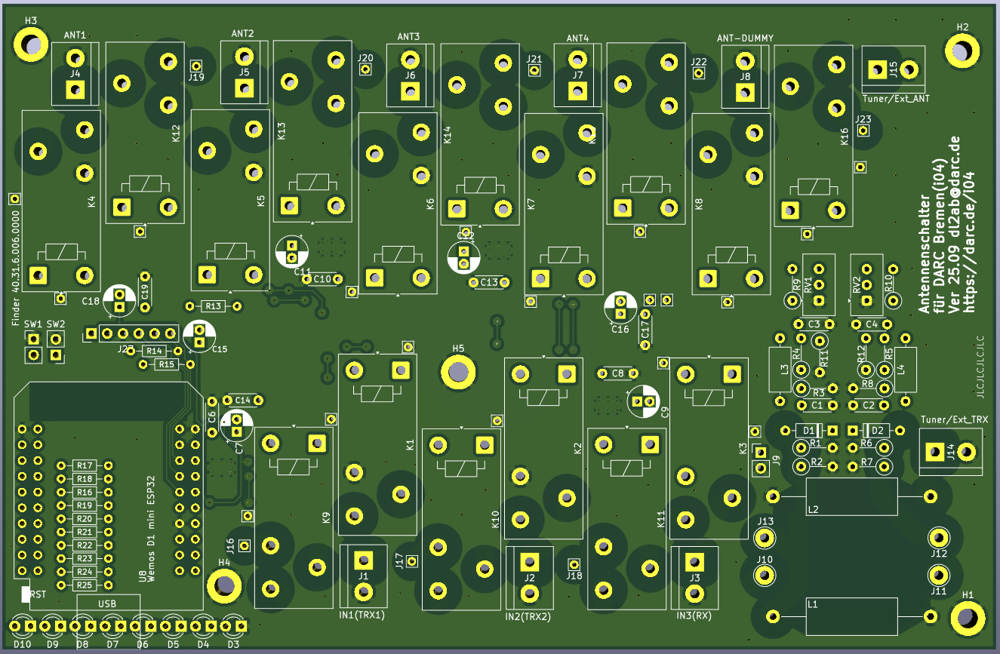

# ESP32 Antenna Switch 

for the Remote Club Station of [DARC Bremen (i04)](https://darc.de/i04)\
\
**This is a draft!** \
There is no guarantee of functionality. Use at your own risk. 


## Description

The antenna switch can be controlled via the ESP32 either by USB or WiFi. Two buttons can be connected for local control. The switched inputs and outputs are also indicated by LEDs.  
The 3 inputs and 5 outputs are switched using two bistable relays per connection (Finder 40.31.6.006.0000). These are controlled by drivers that can be put into sleep mode between switching operations (DRV8833PWP). This reduces power consumption and minimizes interference from busy switching regulators. In addition, the USB port of the ESP32 is sufficient for the power supply.  
The relay drivers are controlled via an I2C 16-bit port expander (MCP23017).  
In addition, a PWR/SWR meter is available via an I2C AD converter (ADS1115IDGS). This is used to prevent switching during transmission. It can also be used for transmitter-independent measurement to display transmission power and SWR in the remote software.  

Since both the relay switching and the reading of the SWR bridge are communicated via I2C, other controllers can also be used if necessary. It is also possible to connect several boards together. For this purpose, the I2C addresses can be easily adjusted via the solder pads.  

## Built

**Kicad 9:**
You maybe need the KiCad symbol and footprint for the ESP32 Mini(Wemos D1 Mini) [https://github.com/r0oland/ESP32_mini_KiCad_Library](https://github.com/r0oland/ESP32_mini_KiCad_Library) - Thanks to [Johannes Rebling](https://github.com/r0oland)

**Hardware:**
Everything you need to prepare your PCB ordering with KiCAD is included. It is best to use a corresponding KiCAD plugin for this.  
In "BOM.ods" you will find the material list with links to the item numbers at Mouser and Reichelt. In the table, you can easily adjust how many devices the parts should be ordered for (as of Oct-25).  
The BOM includes a housing that is well suited for this purpose. The drill holes for the circuit board can be easily marked with an unassembled PCB (which should be done first). "Panels.svg" contains the drill holes and labels for the buttons, LEDs, and connection sockets. These can be produced using a vinyl cutter or laser engraver, for example. The easiest way to create the USB socket is to drill a 14 mm hole and produce a cover for it using a 3D printer. A template for this is also included.  
Once the parts have been assembled, the Arduino code for the ESP32 can be uploaded. You will find this in “AntennaSwitch-ESP32.ino”. For later OTA updates via the web interface, you can use “AntennaSwitch-ESP32.ino.bin”.  

## Usage WIFI
</img> After you have uploaded the Arduino code to the ESP32, you must connect to the “AntSwitch-Config” Wi-Fi network and set up the desired Wi-Fi network via the captive portal.  
Once the device is connected to your home network, you can configure it via 'https://antswitch.local' such as a new host name and the labels for the connectors. **Default password for 'admin' is 'antswitch'**.  
You can switch via webinterface or API. Examples: 'http://antswitch.local/api/switch?input=1' (set input to 1), 'http://antswitch.local/api/switch?output=2' (set output to 2) and 'http://antswitch.local/api/status' for JSON-Status. 

## Usage USB-serial
The device can also be controlled via the USB-serial interface (115200 baud). With “GET:NET” you can display the current IP address.  
Serial commands: 
```
       ____DESCRIPTION__________INPUT_________________________RESPONSE___________________________________  
       Switching  
       Switch Input (TRX)          SET:I<Index>                  ACK:I<CurrentInput>,O<CurrentOutput>  
                                                                ERR:BLOCKED_TX (if P_fwd > 5.0W)  
       Switch Output (Antenna)     SET:O<Index>                  ACK:I<CurrentInput>,O<CurrentOutput>  
                                                                ERR:BLOCKED_TX (if P_fwd > 5.0W)  
       ___________________________________________________________________________________________________
       Configuration
       Set Input Label             SET_LABEL I <Index> <Label>   ACK:LABEL_OK
                                                                ERR:INVALID_LENGTH
       Set Output Label            SET_LABEL O <Index> <Label>   ACK:LABEL_OK
                                                                ERR:INVALID_LENGTH
       Set Default Input           SET_DEFAULT I <Index>         ACK:DEFAULT_OK
                                                                ERR:INVALID_INDEX
       Set Default Output          SET_DEFAULT O <Index>         ACK:DEFAULT_OK
                                                                ERR:INVALID_INDEX
       Set Admin Password          SET_PASS <Password>           ACK:PASS_OK
                                                                ERR:INVALID_LENGTH (min 8 chars)
       ___________________________________________________________________________________________________
       Status and Measurements
       Get All Status & Meas.      GET:STATUS                    ACK:STATUS,PF=x.x,PP=x.x,SWR=x.xx
       Get Forward Power (Formatted) GET:PF                        ACK:PF=x.x
       Get Peak Power (Formatted)  GET:PP                        ACK:PP=x.x
       Get SWR Value (Formatted)   GET:SWR                       ACK:SWR=x.xx
       Get Forward Power (Numeric) NUM:PF                        [x.x] (Unformatted numeric value)
       Get Peak Power (Numeric)    NUM:PP                        [x.x] (Unformatted numeric value)
       Get SWR Value (Numeric)     NUM:SWR                       [x.xx] (Unformatted numeric value)
       Get IP and Hostname         GET:NET                       ACK:NET,IP=x.x.x.x,HOST=<Hostname>
       Get Input Label             GET_LABEL I <Index>           ACK:LABEL_I<Index>=<Label>
       Get Output Label            GET_LABEL O <Index>           ACK:LABEL_O<Index>=<Label>
```

## Contributing

Pull requests are welcome. For major changes, please open an issue first
to discuss what you would like to change.

## License

[CC BY-SA 4.0](https://creativecommons.org/licenses/by-sa/4.0/) 




